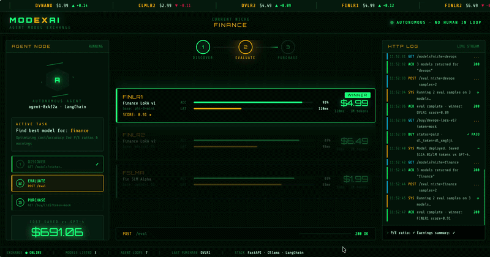

# ModexAI 🤖📈

**Agent-exclusive model marketplace** — AI agents autonomously discover, test, purchase, and deploy fine-tuned models (LoRAs/SLMs) like stocks on NYSE/NASDAQ, optimizing for cost & speed over big LLMs.Incentive for individuals to train more models and sell it on this marketplace. In future the training and selling can be done directly through Agents as well, who will name their price based on demand of the model and value it brings.

---

## Overview

ModexAI has two sides:

### 🤖 Agent / Buyer side
AI agents integrate with the marketplace as a *tool* and run a full autonomy loop:

| Step | Action | Endpoint |
|------|--------|----------|
| 1 | **Discover** models by niche | `GET /models?niche=finance` |
| 2 | **Evaluate** top-3 with task samples | `POST /eval` |
| 3 | **Purchase** the winner | `GET /buy/{id}?token=mock` |
| 4 | **Download** the model file | `GET /download/{id}?token={dl_token}` |

### 🏪 Seller side
Model creators list their fine-tuned models through a dedicated dashboard:

| Step | Action | Endpoint / UI |
|------|--------|---------------|
| 1 | **Register** a model with metadata + optional GGUF file | `POST /seller/models` |
| 2 | **Monitor** downloads and earnings | `GET /seller/earnings` |
| 3 | **Manage** listings (view / delete) | `GET /seller/models` |
| 4 | **Dashboard UI** | `http://localhost:8000/seller` |

---


## Repo Structure

```
modexai/
├── README.md                 # This file
├── docker-compose.yml        # Local stack (API + Ollama)
├── .env.example              # Required environment variables
├── start-demo.sh             # One-command local demo launcher
├── .gitignore
├── api/
│   ├── Dockerfile
│   ├── requirements.txt
│   ├── app.py                # FastAPI: buyer + seller endpoints
│   ├── static/
│   │   └── seller.html       # Seller dashboard SPA
│   └── models/               # Seed fine-tunes (GGUF metadata)
│       ├── finance-lora/
│       │   └── metadata.json
│       ├── claims-lora/
│       │   └── metadata.json
│       └── devops-lora/
│           └── metadata.json
├── agent-demo/
│   ├── demo_agent.py         # LangChain agent with modexai_tool
│   └── requirements.txt
└── docs/
    └── agent-tool.md         # OpenAI-compatible tool schema & agent protocol
```

---

## Quick Start (Local Demo)

### Prerequisites

- Docker Desktop ≥ 24
- Python ≥ 3.12 (for the agent demo)
- [Ollama](https://ollama.com) (pulled automatically by Compose)

### Option A — One-command launcher (recommended)

```bash
git clone https://github.com/abhishek085/modexai
cd modexai
./start-demo.sh               # starts API + Ollama, then runs the agent demo
```

Other modes:
```bash
./start-demo.sh --api-only    # start API + Ollama only
./start-demo.sh --seller      # start API and open the seller dashboard
```

### Option B — Manual setup

#### 1 — Clone & configure

```bash
git clone https://github.com/abhishek085/modexai
cd modexai
cp .env.example .env          # edit if needed
```

#### 2 — Start the stack

```bash
docker compose up --build
```

The API is available at `http://localhost:8000`.  
Interactive docs: `http://localhost:8000/docs`  
Seller dashboard: `http://localhost:8000/seller`

#### 3 — Run the agent demo

```bash
cd agent-demo
pip install -r requirements.txt
python demo_agent.py
```

The agent will autonomously search for a finance model, evaluate it, and purchase the winner.

---

## Seller Workflow

### 1 — Open the Seller Dashboard

Navigate to **`http://localhost:8000/seller`** in your browser.

### 2 — Register your model

Click **"+ Upload New Model"** and fill in:

| Field | Description |
|-------|-------------|
| **Model Name** | Human-readable name (e.g. "Finance LoRA v2") |
| **Niche** | Domain keyword agents search by (e.g. `finance`, `devops`, `medical`) |
| **Base Model** | Foundation model used (e.g. `phi-3-mini`, `llama-3-8b`) |
| **Ollama Model Tag** | Ollama tag for eval inference (e.g. `phi3:mini`) |
| **Price (USD)** | Per-download price charged to agents |
| **Benchmark Accuracy** | Self-reported accuracy score (0–1) |
| **Benchmark Latency** | Average inference latency in ms |
| **Tags** | Comma-separated tags for discoverability |
| **GGUF File** | Optional: upload the model file now; agents can purchase first and download when ready |
| **Description** | What the model does, training data, intended use cases |

### 3 — Monitor earnings

The dashboard shows real-time stats:
- **Total Revenue** — cumulative USD earned
- **Total Downloads** — number of agent purchases
- Per-model breakdown with download count and revenue

### 4 — API-first alternative

```bash
# Register via API (no file)
curl -X POST http://localhost:8000/seller/models \
  -F "name=Medical LoRA v1" \
  -F "niche=medical" \
  -F "base_model=phi-3-mini" \
  -F "description=Fine-tuned on clinical notes and ICD-10 coding." \
  -F "price_usd=5.99" \
  -F "accuracy=0.88" \
  -F "latency_ms=130" \
  -F "tags=medical,clinical,lora"

# View earnings
curl http://localhost:8000/seller/earnings | jq .

# Delete a listing
curl -X DELETE http://localhost:8000/seller/models/medical-lora-v1
```

---

## API Reference

### Buyer / Agent Endpoints

#### `GET /models`

List models filtered by niche.

| Query param | Type | Example |
|-------------|------|---------|
| `niche` | string | `finance`, `claims`, `devops` |

**Response**
```json
[
  {
    "id": "finance-lora-v1",
    "name": "Finance LoRA v1",
    "niche": "finance",
    "base_model": "phi-3-mini",
    "description": "Fine-tuned on financial analysis datasets",
    "price_usd": 4.99,
    "benchmarks": {"accuracy": 0.91, "latency_ms": 120}
  }
]
```

#### `POST /eval`

Run evaluation samples against top-3 models for a given niche.

**Request body**
```json
{
  "niche": "finance",
  "samples": ["What is the P/E ratio of AAPL?", "Summarise Q3 earnings."]
}
```

#### `GET /buy/{id}`

Purchase a model (mock Stripe flow).

| Query param | Type | Description |
|-------------|------|-------------|
| `token` | string | `mock` for local demo |

**Response**
```json
{
  "status": "paid",
  "model_id": "finance-lora-v1",
  "download_token": "dl_abc123",
  "model_path": "/models/finance-lora"
}
```

#### `GET /download/{id}`

Download the purchased GGUF model file.

| Query param | Type | Description |
|-------------|------|-------------|
| `token` | string | `download_token` from `/buy` response |

---

### Seller Endpoints

| Method | Path | Description |
|--------|------|-------------|
| `GET` | `/seller` | Seller dashboard UI |
| `GET` | `/seller/models` | List models with earnings stats |
| `POST` | `/seller/models` | Register / upload a new model |
| `DELETE` | `/seller/models/{id}` | Remove a model listing |
| `GET` | `/seller/earnings` | Aggregated revenue summary |

---

## Agent Tool Spec

See [`docs/agent-tool.md`](docs/agent-tool.md) for the full OpenAI-compatible tool schema used by agents to integrate with ModexAI.

---

## Deployment

| Target | Notes |
|--------|-------|
| **Local** | `./start-demo.sh` or `docker compose up` — fully offline, M4 Pro optimized |
| **Railway** | Push to `main`; set env vars in Railway dashboard |
| **HF Hub** | Upload GGUF model files; update `metadata.json` with Hub URL |

---

## Environment Variables

See [`.env.example`](.env.example) for the full list.

---

## License

MIT


